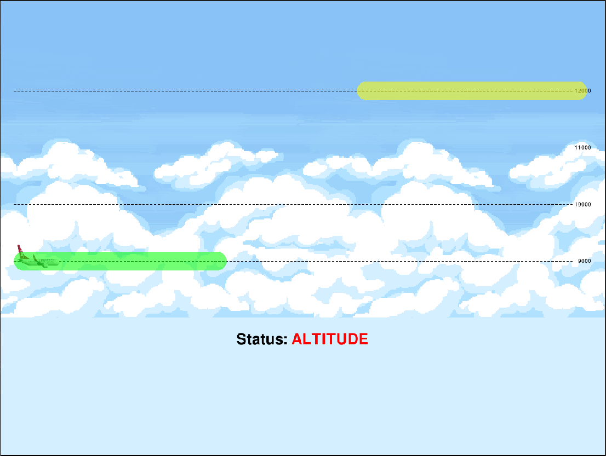

# Autopilot: Flight Simulator for Embedded Systems Development

This simulator is created to simulate a flight controlled by primarily PIC18F8722 and possibly many others. It uses PyGame for UI and pyserial for serial communication.

Altitude Mode Screen | Demo Video
:-----------------------------------------------------------------------------:|:-------------------------:
  |  

Plane is at all times either one of the 4 altitude lines. Yellow zones are called "altitude zones" and the plane is expected to be at that altitude level as long as that zone lasts.

Plane altitude is controlled by ADC and the plane height only changes while in "ALTITUDE" mode as in the screenshot.

A more detailed explanation on the development process is on my blog, [here.](https://medium.com/@oguzhanoztaskin/autopilot-flight-simulator-for-embedded-systems-development-7126a7c206c1).

## Features

- Expects 100ms periodic messages and logs on erroneous messages.
- Tests serial: Sends commands and expects responses from the board.
- Tests ADC readings: Shows altitude zones in the UI and expects the user to put the plane to the desired altitude by changing ADC value.
- Tests buttons: Lits leds on the board and expects the corresponding button to be pressed within the led timeout.
- Tests periodicity: Distance agent runs from start to end and missing its messages causes accumulating error.
- Consists of many small modular agents for ease of development, maintenance, and creating new tests.

## How to run?

Connect the board to your computer via serial and then `ls /dev/ttyUSB*` to see the name of the device read from it. Then, in `autopilot-settings.json`, type this device path in the `PORT` field. Also set `BAUDRATE` to what you are using on the board.

Finally, run `python3 autopilot.py` to start the simulator and press 's' key to send GO command to the board.

## Known Issues

- Simulator related bugs are logged as critical (board related issues are logged as errors). Though they never became an actual problem.
- Simple threading issues causes most of the critical errors. Mutexes are needed on the agents.
- Rarely, some newer and clearer logs are needed.

## TODO

- Use mutexes on PeriodicAgents as "on_period_finished" and "attempt_cmd" are called from different threads.
- Make it simpler to create, configure, and add agents to the Autopilot.
- Rewrite log texts as needed.
- Refactor.
- Implement master.py, an example implementation of the board functionalities in Python for testing.

## Non-Features

- Checksum
- Input simulation and output checks for buttons and ADC.